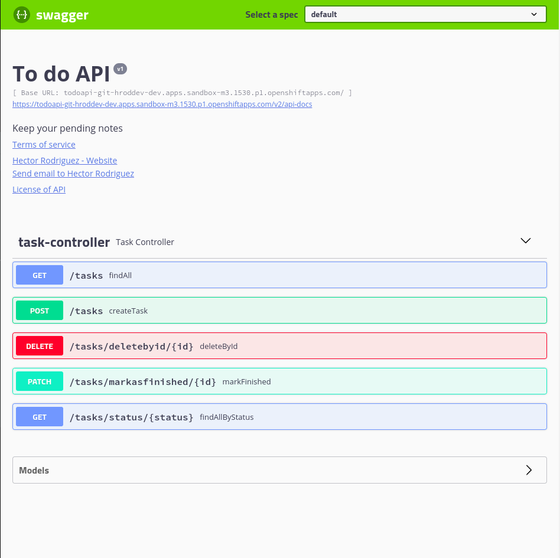

# To do API
> To do demo project making in Java/Spring Boot.

[![Java Version][java-image]][java-url]
[![Spring version][spring-image]][spring-url]


You can create new tasks, delete it, show all, find by status and change if completed.


### [Try the todo api deploy](https://todoapi-git-hroddev-dev.apps.sandbox-m3.1530.p1.openshiftapps.com/swagger-ui.html#/)

## Installation

Download and try:

Use yor favorite IDE, mine is [Intellij IDEA](https://www.jetbrains.com/idea/download/)


```sh
git clone https://github.com/hroddev/todoapi.git
```

## Usage example

A few motivating and useful examples of how your product can be used. Spice this up with code blocks and potentially more screenshots.

_For more examples and usage, please refer to the [Wiki][wiki]._

## Development setup

Describe how to install all development dependencies and how to run an automated test-suite of some kind. Potentially do this for multiple platforms.

```sh

```

## Release History

* 0.0.1
    * Work in progress


<!-- Markdown link & img dfn's -->
[java-image]: https://img.shields.io/badge/Java-version%2017-orange
[java-url]: https://openjdk.org/projects/jdk/17/
[spring-image]: https://img.shields.io/badge/Spring-version%202.54-brightgreen
[spring-url]: https://spring.io/
